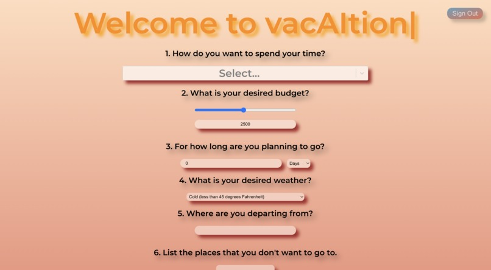
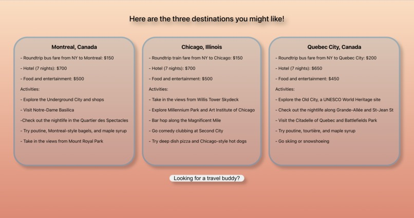
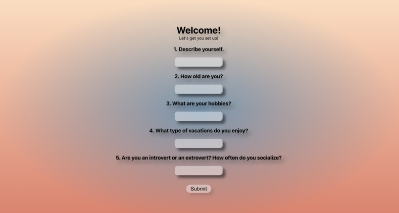
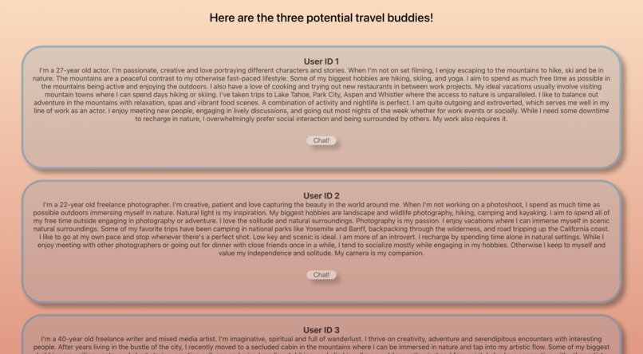
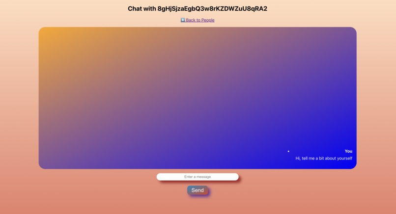

# vacAItion

## Inspiration
First time traveler who needs help picking a destination? Frequent traveler who ran out of ideas? Need a travel buddy? Every time you travel your needs are not met? Tired of researching potential destinations for hours? Want to go somewhere but can't come up with an idea that fits your budget?

Many people are hindered from taking high-quality vacation because they struggle to answer the above questions. Our travel recommendation platform tackles that and lets potential travelers find solutions and make decisions.

## What it does
**vacAItion** has the following functionalities:

- We ask users to fill out a short questionnaire about their vacation preferences (they can include even the most absurd ones like "I don't want to be in a country with a lot of cats").
- Then, with the use of Claude we give them 3 recommendations for places they can travel to, along with an approximated budget and 5 activities they might enjoy in each location.
- Such recommendations are very versatile: if the user has a very limited budget that does not allow for air travel, we will suggest a nearby place reachable by car/train/bus. If the user does not hold a powerful passport, we will focus on the places that are more accessible to them.
- Next, if the user is looking for a travel buddy, they have an option to fill out a questionnaire about themselves that asks them about their hobbies, personality, and vacation preferences. It then proceeds to suggest them several most similar users - they are chosen with the help of rerank by Cohere based on the answers to the questions.
- The users have an option to chat with their suggested people (via our built-in chat), as well as to see 3 destination recommendations that they could go to together with this user (such a place matches both of the users' requests).

## How we built it
Our backend is implemented through Python. We used Claude for generating destination recommendations and Cohere's rerank for matching users with each other. Our user database and authentication are implemented via Firestore and Firebase. Modal is used for hosting the backend, and GitHub Pages for hosting the frontend. They communicate with each other via fetch requests. Frontend is implemented with ReactJS (with typed.JS).

## Challenges we ran into
Our main challenge is that Claude is relatively slow in generating output, but that is complicated by our request to give us the result in a certain format, which makes the generation of results take even longer.

## Accomplishments that we're proud of & what we learned
We are proud of figuring out how to generate prompts for Claude in a way such that it returns in an appropriate format for future parsing.

## Pages

## What's next for vacAItion
We believe in making trips more enjoyable and tailored to each person -- there is so much to see in the world! Here are the functionalities we plan to add in the future:

1. Paid features
    - Detailed itinerary of the trip with links to tickets, hotels, and activities (through web scraping & ML)
    - Traveler personality profile

2. Expanded recommendations
    - Customize by:
        - Comfort (luxury, budget, average)
        - Style (family, friends, solo)

3. Expanded travelers matching
    - Match groups of travelers
    - Ability to add friends/family to get joint recommendations
    - Security verifications

## Built With
- Claude
- Cohere
- FastAPI
- Firebase
- JavaScript
- Modal
- Python
- React
- Rerank